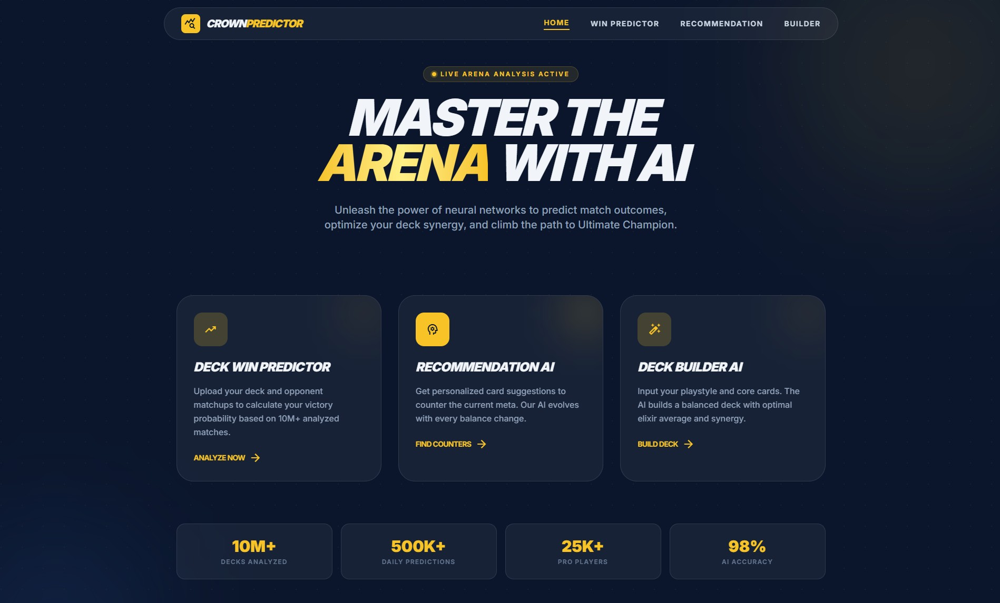
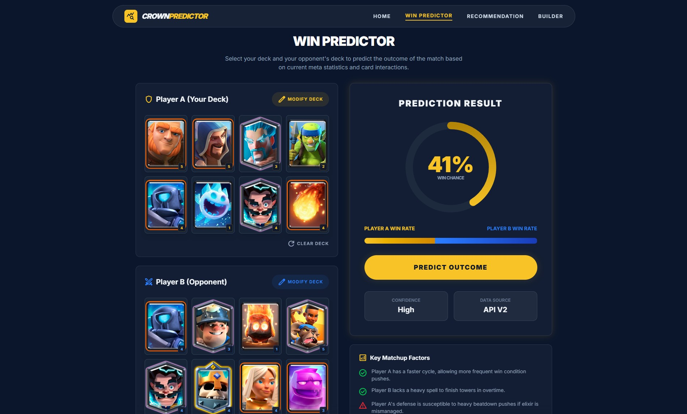
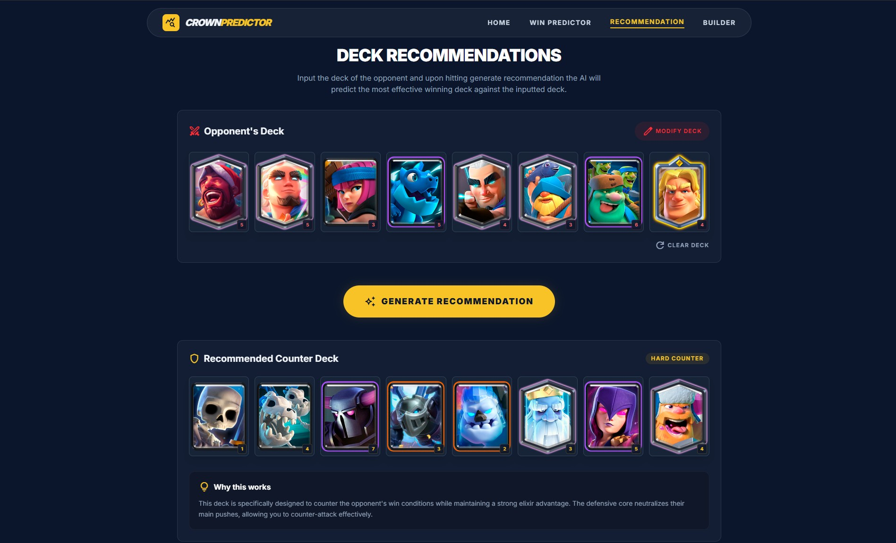
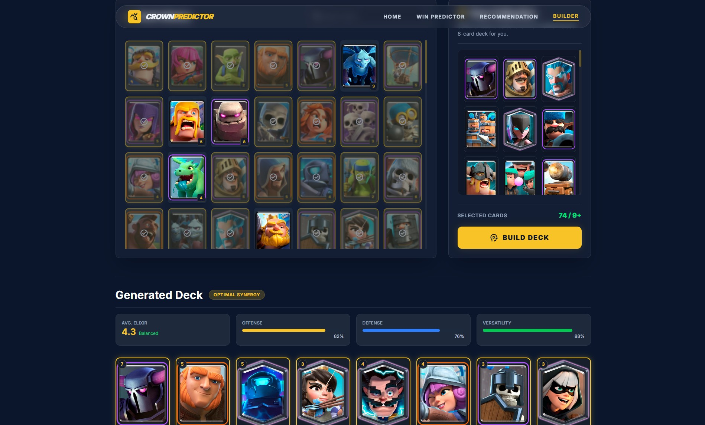

# Clash Royale AI Strategy Tools
- This project is a machine learning based web application that provides strategy tools for players of Clash Royale.
- The platform integrates three AI systems that help players analyze deck matchups, find counter decks, and build optimized decks using real match data.
## Overview
- The goal of this project is to demonstrate how machine learning can be used to analyze competitive game data and assist players in making better strategic decisions.
- The system analyzes historical match data to learn patterns between decks and match outcomes, enabling it to predict win probabilities and recommend stronger deck strategies.
## Features
### Deck Win Predictor
Predicts the probability of winning against an opponent deck.
##### Input
Your deck
Opponent deck
##### Output
Win probability
### Counter Deck Recommendation AI
Suggests decks that are effective counters against the opponent's deck.
##### Input
Opponent deck
##### Output
Recommended counter decks
### Deck Builder AI
Generates the best possible deck using the cards owned by the user.
##### Input
Cards owned
##### Output
Optimized deck suggestion
## Screenshots
### Homepage

### Deck Win Predictor

### Deck Recommendation AI

### Deck Builder AI

## Datasets used:
https://www.kaggle.com/datasets/bwandowando/clash-royale-season-18-dec-0320-dataset
https://www.kaggle.com/datasets/s1m0n38/clash-royale-games
cards.json
These datasets contain real Clash Royale ladder match data including decks used and match results.
## Tech Stack
### Machine Learning
Python
Pandas
Scikit-learn
XGBoost
### Frontend
HTML
CSS
JavaScript
### Backend
Python
## Future Improvements
Opponent deck prediction AI
Card synergy analysis
Meta analysis dashboard